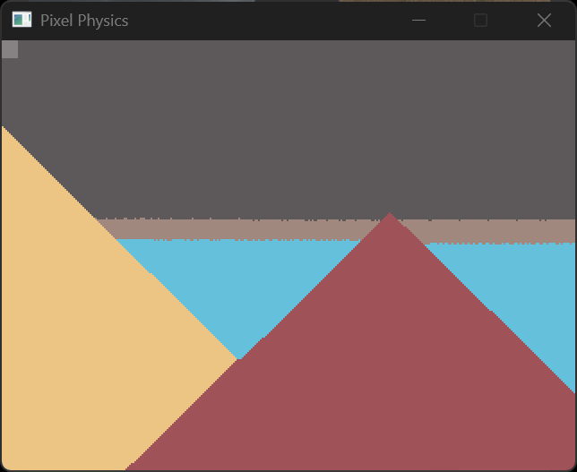

# Pixel Physics

A simple 2D physics sandbox game where you can place blocks of different materials and watch them interact with each other.



## Downloading

Head to the [actions tab](https://github.com/someretical/pixel-physics/actions) and access the latest build. Download the artifact that matches your operating system. Linux users will be able to choose between GNU and clang builds. Extract the contents of the archive and run the executable.

## Controls

The brush is the highlighted square under the cursor.

- Left click (M1) to set all pixels in the brush area to the selected material
- Right click (M2) to erase all pixels in the brush area
- Scroll up and down to increase and decrease the size of the brush respectively
  - Hold left control to change the brush size in increments of 10
- Middle click to set the brush material to the material of the pixel directly under the cursor
- Press F11 to toggle borderless fullscreen

### Available materials

- Press 1 to select regular sand
- Press 2 to select red sand (more dense than regular sand)
- Press 3 to select water
- Press 4 to select oil (less dense than water)

More features to come...

## Building

Download sources

```
git clone --recurse-submodules https://github.com/someretical/pixel-physics.git
```

Add submodule

```
git submodule add -b <branch-name> <repository-url> <folder>
```

Update submodules to latest commit

```
git submodule update --init --recursive --remote
```

Checkout branch for specific submodule

```
git config -f .gitmodules submodule.<path_to_submodule>.branch <branch_name>
git submodule update --remote --recursive
```

E.g, `git config -f .gitmodules submodule.dependencies/SDL.branch main`

Checkout tag for specific submodule

```
cd dependencies/<submodule>
git fetch --tags
git checkout tags/<tag_name>
```

Don't forget to commit the submodule updates! Also use `git submodule status` to see the paths and status.

## Windows

1. Install MSVC with Clang support
2. Install the VSCode clangd extension
   - The extension won't automatically find the clangd installed under Visual Studio so the path will need to be provided. E.g, `E:\Microsoft Visual Studio\2022\Community\VC\Tools\Llvm\x64\bin\clangd.exe`
3. Install the VSCode CMake extension and use the following settings

```json
"cmake.generator": "Ninja Multi-Config",
"cmake.preferredGenerators": ["Ninja Multi-Config"]
```

If the generator is set to Microsoft Visual Studio 2022 (which uses MSBuild under the hood), no `compile_commands.json` will be generated and clangd won't work properly.

4. Select the CMake icon from the activity bar on the left side and under the Configure dropdown choose the right kit (e.g, MSVC, clang, g++) and build (e.g, Debug, Release)
5. The Build (different from the build mentioned above), Test, Debug, and Launch dropdowns apply to the current configuration

Alternatively, set everything up from the CLI

```
cmake -DCMAKE_C_COMPILER=<FILL_IN> -DCMAKE_CXX_COMPILER=<FILL_IN> --no-warn-unused-cli -S <pixel-physics-path> -B <build-folder> -G "Ninja Multi-Config"

cmake --build e:/pixel-physics/build --config Debug
```

E.g, (copy pasted from VSCode CMake extension output)

```
"E:\Microsoft Visual Studio\2022\Community\Common7\IDE\CommonExtensions\Microsoft\CMake\CMake\bin\cmake.exe" -DCMAKE_EXPORT_COMPILE_COMMANDS:BOOL=TRUE "-DCMAKE_C_COMPILER:FILEPATH=E:\Microsoft Visual Studio\2022\Community\VC\Tools\Llvm\x64\bin\clang-cl.exe" "-DCMAKE_CXX_COMPILER:FILEPATH=E:\Microsoft Visual Studio\2022\Community\VC\Tools\Llvm\x64\bin\clang-cl.exe" --no-warn-unused-cli -S E:/pixel-physics -B e:/pixel-physics/build -G "Ninja Multi-Config"

"E:\Microsoft Visual Studio\2022\Community\Common7\IDE\CommonExtensions\Microsoft\CMake\CMake\bin\cmake.exe" --build e:/pixel-physics/build --config Debug
```
